# STR Platform ERD

```mermaid
erDiagram
  USERS ||--|| USER_PROFILES : has
  USERS ||--o{ DRIVER_VERIFICATIONS : verifies
  USERS ||--o{ DEVICE_TOKENS : owns
  USERS ||--o{ JOBS : creates
  USERS ||--o{ JOBS : fulfills
  JOBS ||--o{ JOB_PHOTOS : has
  JOBS ||--|| JOB_LOCATIONS : located_at
  USERS ||--|| COURIER_LOCATIONS : updates
  JOBS ||--o{ OFFER_PINGS : offered_to
  USERS ||--o{ OFFER_PINGS : receives
  USERS ||--|| VENDOR_ACCOUNTS : owns
  USERS ||--|| COURIER_ACCOUNTS : owns
  JOBS ||--|| GREEN_IMPACT_METRICS : impact
  JOBS ||--|| GREEN_IMPACT_RECEIPTS : receipt
  DONATION_PARTNERS ||--o{ UPCYCLABLE_ITEMS : receives
  JOBS ||--o{ UPCYCLABLE_ITEMS : contains
  JOBS ||--o{ LEDGER_ENTRIES : references
  USERS ||--o{ PAYMENTS : pays
  USERS ||--o{ PAYOUTS : receives
  JOBS ||--|| SDS_CASES : assessed
  USERS ||--o{ COURIER_COMPLETIONS : completes
  COURSES ||--o{ COURIER_COMPLETIONS : has
  USERS ||--o{ COURIER_BADGES : earns
  BADGES ||--o{ COURIER_BADGES : assigned
  JOBS ||--|| DISPUTES : disputed
  USERS ||--o{ NOTIFICATION_LOGS : receives
  JOBS ||--o{ REVIEWS : evaluated
```

Spatial columns:
- `job_locations.geom`: `POINT(4326)`
- `courier_locations.geom`: `POINT(4326)`
- `transfer_stations.geom`: `POINT(4326)`
- `donation_partners.geom`: `POINT(4326)`
- `neighborhood_groups.geom`: `POLYGON(4326)`
