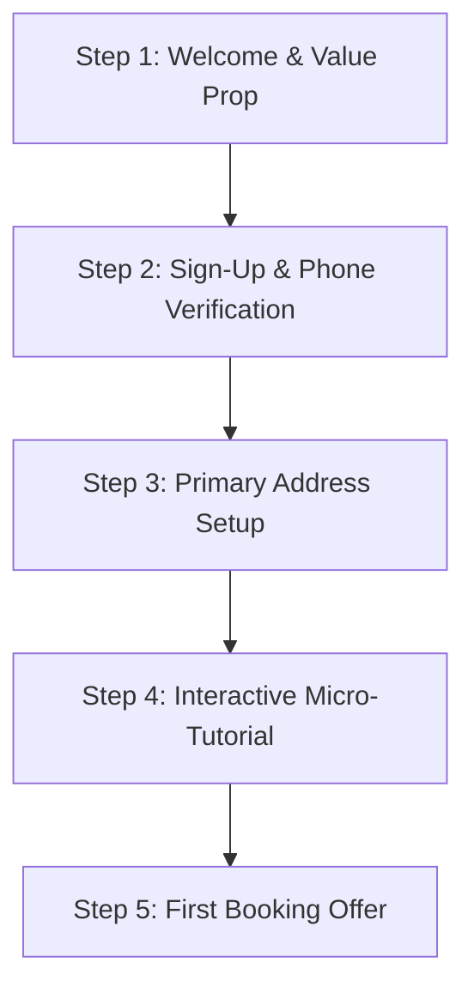

# Customer Onboarding Flow: Shuk Trash Removal (STR)
**Subject:** User Acquisition, Initial Onboarding, and Tutorial Layout

---

## 1. Onboarding Funnel Steps

---

## 2. Step Details

### Step 1: Welcome & Value Proposition Screen
* **Visuals:** High-contrast logo of Shuk Trash Removal with rotating background images of clean streets and green spaces.
* **Heading:** "Let Shuk take it to the curb."
* **Sub-Heading:** "Gig-economy curbside trash placement and on-demand junk removal at your fingertips."
* **Action Button:** "Get Started"

### Step 2: Authentication & Registration
* **Input Fields:**
  * Full Name
  * Email Address
  * Mobile Phone Number
  * Password
* **Verification:** Secure SMS One-Time Password (OTP) verification sent to the mobile device.

### Step 3: Address & Property Profile Setup
* **Search Field:** Google Places Auto-complete address search.
* **Property Type Selection:**
  * Single-Family Home (curbside rollout)
  * Apartment/Condo (specific chute or complex dumpster access)
  * Commercial Site
* **Instructions Notes:** Optional text area for gate codes, pet alerts, or path details.

### Step 4: Platform Guidelines & Tutorial
An interactive slideshow showcasing how to use the app:
1. **Snap & Book:** How to photograph your trash piles to get a precise, instant AI volume estimate.
2. **Eco-Friendly Upcycling:** Toggle "Upcycle Mode" to flag items for donation hubs and lower your environmental impact.
3. **Neighborhood Runs:** Join an active batch route nearby to save 25% on services and minimize carbon emissions.
4. **Safety Protocols:** What is permitted (general house trash, lawn trimmings) vs. restricted (hazardous solvents, batteries, medical waste).

### Step 5: First-Time User Welcome Offer
* **Promotion:** Direct $10.00 discount applied to the first on-demand pickup.
* **CTA Button:** "Create Your First Trash Cart"
