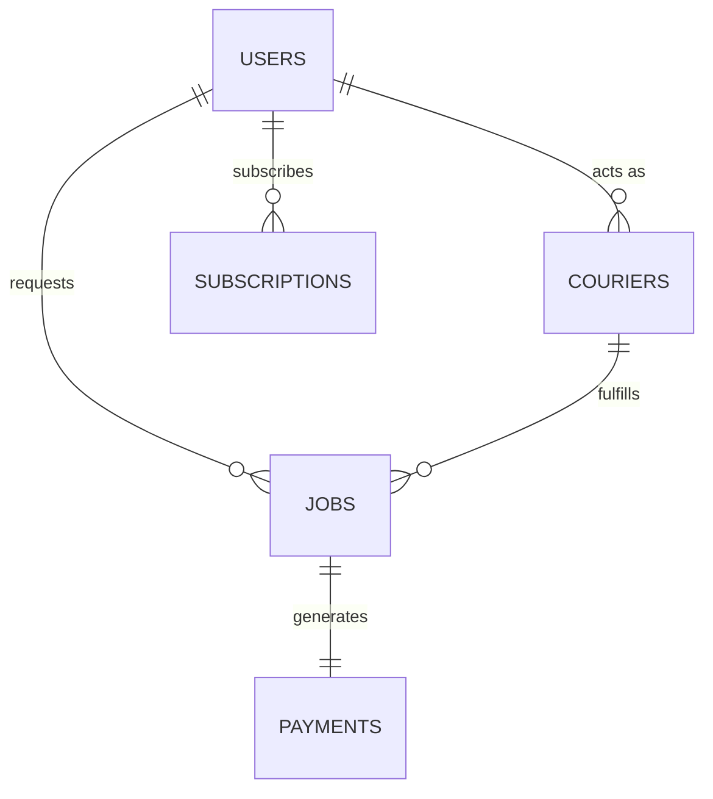

# Database ERD: Shuk Trash Removal (STR)
**Subject:** Text-Based Relational Schema & Table Definitions

---

## 1. Relational Schema Diagram

---

## 2. Table Definitions

### Table: Users
Stores authentication and profile information for all users (Customers, Couriers, and Admins).
* `id` (UUID, Primary Key)
* `name` (VARCHAR)
* `email` (VARCHAR, Unique) - Login credentials
* `phone` (VARCHAR)
* `role` (VARCHAR) - Values: `vendor` (customer), `courier`, `admin`
* `address` (VARCHAR)
* `created_at` (TIMESTAMP)

### Table: Couriers
Contains metrics, vehicle specifics, and status variables for independent contractors.
* `id` (UUID, Primary Key)
* `user_id` (UUID, Foreign Key -> `Users.id`)
* `vehicle_type` (VARCHAR) - e.g. `pickup`, `trailer`, `box_truck`
* `vehicle_capacity_yd3` (FLOAT)
* `rating` (FLOAT)
* `is_online` (BOOLEAN)
* `earnings_total` (DECIMAL)
* `hazmat_certified` (BOOLEAN)

### Table: Jobs
Main transaction table representing curbside bin runs and junk removal orders.
* `id` (UUID, Primary Key)
* `customer_id` (UUID, Foreign Key -> `Users.id`)
* `courier_id` (UUID, Foreign Key -> `Couriers.id`, Nullable)
* `status` (VARCHAR) - e.g. `draft`, `unassigned`, `accepted`, `en_route`, `completed`
* `waste_category` (VARCHAR)
* `estimated_volume_yd3` (FLOAT)
* `pickup_address` (VARCHAR)
* `pickup_lat` (FLOAT)
* `pickup_lng` (FLOAT)
* `quoted_price` (DECIMAL)
* `tip_amount` (DECIMAL)
* `is_upcycle_requested` (BOOLEAN)
* `upcycle_description` (TEXT)
* `created_at` (TIMESTAMP)

### Table: Payments & Ledger
Double-entry ledger format showing financial flows, fees, and splits.
* `id` (UUID, Primary Key)
* `job_id` (UUID, Foreign Key -> `Jobs.id`)
* `total_amount` (DECIMAL) - Customer total price paid
* `courier_payout` (DECIMAL) - Courier earnings
* `stripe_fee` (DECIMAL) - Processing costs
* `owner_payout_45` (DECIMAL) - 45% profit share split to **Shukrani Ahadi**
* `platform_retained_55` (DECIMAL) - 55% platform operating fund
* `timestamp` (TIMESTAMP)

### Table: Subscriptions
Handles recurring curbside rollout schedules for loyal clients.
* `id` (UUID, Primary Key)
* `customer_id` (UUID, Foreign Key -> `Users.id`)
* `frequency` (VARCHAR) - e.g. `weekly`, `biweekly`
* `next_pickup_date` (TIMESTAMP)
* `active` (BOOLEAN)
